# 🛰️ Vision Scout 🔍

Welcome aboard **Vision Scout**! 🚀 This isn't just another tool that spots objects in pictures. Vision Scout digs deeper, aiming to **understand the whole story an image tells**. I blend the sharp eyes of **YOLOv8** for object detection, the contextual smarts of **OpenAI's CLIP** for semantic understanding, the scene classification power of **Places365**, and the advanced narrative capabilities of **Meta's Llama 3.2** to bring it all together. The result? A system that can figure out the scene type (is it a crossroads or a quiet bedroom?), gauge the lighting, map out how things are arranged, guess what might be happening, and even point out things to watch out for, all presented in a cohesive, human-like story. It's all wrapped up in a friendly Gradio web app.

**Why Vision Scout?**

While many tools detect objects, Vision Scout offers more:
* **Multi-Modal Intelligent Fusion:** It doesn't just *see* objects (YOLOv8), it understands the *context* and *vibe* (CLIP), establishes environmental baseline with comprehensive scene classification (Places365), and smartly combines all three perspectives for superior scene identification. This triple-layer approach ensures robust understanding whether the scene is defined by specific objects, overall atmosphere, or fundamental environmental characteristics.
* **Rich Narratives, Elevated by LLM:** Forget simple tags. Vision Scout, enhanced by **Llama 3.2**, crafts detailed, human-like descriptions that truly tell the story of the scene, making complex visual information accessible and engaging.
* **Spatial Smarts:** It figures out where things are in relation to each other, identifying functional zones like 'dining areas' or 'workspaces'.
* **From Snapshots to Statistical Intelligence**: VisionScout now extends beyond single image analysis to provide comprehensive video processing capabilities. The system performs temporal object detection with sophisticated duplicate elimination algorithms, generating detailed statistical reports including object counts, appearance timelines, and quality metrics. Rather than traditional tracking, VisionScout applies spatial clustering techniques to ensure accurate counting and provides timeline analysis showing when objects first appear and their duration in the video. 

---

## 📊 Project Impact
**This project has achieved:**

> 

---

## ⚠️ Important Notice
**Due to a current GitHub issue with rendering Jupyter notebooks (missing 'state' key in metadata.widgets), the notebook code and outputs may not display properly in this repository.**

For the complete notebook with all outputs and visualizations, please access the project via this Google Colab link:  
👉 [View Complete Project](https://colab.research.google.com/drive/1o3DrST3j2CyDI0xf-M_Ym8Cav7t0y28H?usp=sharing)

The issue is being tracked by GitHub and will be resolved as soon as possible. Thank you for your understanding!

---

## 🎯 What Vision Scout Offers

Think of Vision Scout as your AI companion for analyzing images. Here's a glimpse of what it brings to the table:

* **Sharp Object Spotting:** Uses **YOLOv8** (pick 'n', 'm', or 'x' for speed vs. accuracy) to find objects quickly and reliably. Furthermore, you can control the confidence threshold and filter *for* specific object types (like people or vehicles), meaning *only* those selected objects will be displayed in the results. This filtering can be helpful when focusing on particular elements in a scene.

* **Clear Statistics & Visualization:** Provides clear statistics and a visual bar chart summarizing what objects were detected and how many of each type were found.

* **Scene Foundation with Places365:** The **Places365** model provides the environmental baseline, classifying scenes across 365 categories from parks to kitchens to streets. This ResNet50-based foundation gives the system its initial understanding of the setting, which then guides and enhances all other analytical components.

* **Understanding the Vibe with CLIP:** This is where Vision Scout truly shines. **CLIP** grasps the image's overall meaning by comparing it to descriptions covering everything from 'city street' vs 'living room' to 'daytime clear' vs 'neon night', understanding context objects alone can't provide. It's also employed for zero-shot landmark recognition, identifying famous locations and architectural features that might not be caught by standard object detection.

* **Smarter Scene Classification (Multi-Modal Fusion):** Vision Scout intelligently **combines** YOLOv8's object data, CLIP's contextual understanding, and Places365's scene classification through dynamic weight fusion. This *hybrid scoring* improves scene identification by cleverly weighting evidence—leaning more on YOLO for object-defined scenes (like kitchens) and more on CLIP for atmosphere-defined scenes (like night markets), while using Places365 as the foundational environmental context.

* **Telling the Story - Rich & Refined Descriptions with LLM:** Instead of just a list, the `EnhancedSceneDescriber` crafts an initial detailed narrative. Then, the **`LLMEnhancer` (powered by Llama 3.2)** takes this further, refining the story for superior fluency and contextual depth. It weaves together the scene type, objects, lighting, viewpoint, functional zones, and even cultural hints into a highly readable and insightful paragraph, ensuring factual consistency with the visual evidence.

* **Mapping the Scene - Spatial Awareness:** The `SpatialAnalyzer` looks at object positions, maps them to image regions (top-left, bottom-right, etc.), and identifies **functional zones** (like spotting chairs and a table as a 'dining area').

* **Reading the Light - Enhanced Lighting Analysis:** Bright day, dim room, or neon night? The `LightingAnalyzer` employs a sophisticated approach, analyzing brightness, colors, and contrast while incorporating guidance from Places365's indoor/outdoor classification to determine precise **lighting conditions**. This Places365-guided enhancement ensures more accurate lighting assessment by considering the environmental context.

* **Reading Between the Lines - Activity, Safety & LLM Verification:** Based on the scene and objects (like people near traffic or sharp items in a kitchen), the system suggests **likely activities** and flags potential **safety points**. Furthermore, if conflicting interpretations arise between object detection and semantic analysis, the **LLM** can be optionally invoked to **verify and reconcile** these differences, offering an additional layer of intelligent assessment to the scene understanding.

* **Video Understanding**: Upload a video, and the system will extract frames at your chosen interval and run object detection on each frame. It provides frame-by-frame statistics and an overall summary in structured JSON format, showing which object classes appeared and how often. While object tracking and scene description updates are not yet implemented, the current architecture is designed to support future enhancements such as multi-frame tracking, dynamic scene understanding, and LLM-based video summarization.

* **An Interface for Exploration:** All this analysis is presented through a **Gradio web app**. Easily upload images, tweak settings, and view results in organized tabs (annotated image, stats, full report). The LLM-enhanced descriptions are clearly marked, allowing you to appreciate the AI's advanced narrative capabilities.

---
## 🧠 How It All Comes Together: The Vision Scout Flow

Vision Scout works like a team of AI specialists, each examining your image from their unique perspective before coming together to tell the complete story. It's a collaborative process where different components analyze in parallel, then intelligently combine their insights. The flowchart below shows how this all unfolds, followed by a detailed walkthrough:

  

1️⃣ **Image Input and Preprocessing**

   When you upload an image, Vision Scout first ensures it's in the right format for analysis. Whether you provide a PIL Image, Numpy array, or other format, the system converts it to RGB format and temporarily stores it, setting the stage for all the analytical work ahead.

2️⃣ **Multi-Modal Perception: The Initial Assessment**

   This is where the magic starts. Your image gets sent down multiple analytical pathways in a carefully orchestrated sequence:

   * **Places365 Scene Classification** initiates the process with a ResNet50 model trained on 365 different scene categories. Think of it as the generalist who takes one look and says "this feels like a kitchen" or "looks like a park to me." It provides that crucial first impression along with a confidence score, plus an early assessment about whether we're looking at an indoor or outdoor scene.
   * **YOLOv8 Object Detection** operates in parallel, conducting detailed inventory work by scanning the image to identify specific objects and their exact locations, complete with bounding boxes and confidence levels for each detection. This provides the concrete "what's actually in this picture" foundation that everything else builds upon.

3️⃣ **Feature Enhancement and Deep Analysis**

   Now the system layers on more sophisticated analysis through coordinated processing:

   * **Lighting Analysis** dives deep into visual characteristics, examining brightness levels, color distributions, and textures to determine lighting conditions. Is this a sunny day? A dimly lit indoor room? Night scene with artificial lighting? It intelligently incorporates the indoor/outdoor assessment from Places365 to refine its conclusions.
   * **Spatial Object Mapping** takes the object locations from YOLO and maps them onto a spatial grid, understanding how elements are arranged across different regions of the image. This spatial awareness becomes crucial for identifying functional zones later in the process.
   * **Semantic Scene Analysis** employs CLIP to create a unique "fingerprint" of your image, then compares this against hundreds of text descriptions to understand overall meaning and context. This captures atmosphere, cultural context, and subtle visual cues that pure object detection might miss.
   * **Landmark Recognition**, an optional yet powerful feature that can be enabled by the user, uses CLIP's zero-shot classification capabilities to spot famous landmarks that might be missed by standard object detectors. When activated, it intelligently examines the entire image and specific regions where YOLO had low confidence or identified large, undefined structures, using multi-scale analysis to identify well-known global and regional points of interest.

4️⃣ **Multi-Dimensional Scoring Engine**

   Here's where the different analytical streams converge through the Scene Analysis Coordinator. The system runs three parallel scoring mechanisms:

   * **YOLO-based scoring** focuses on object-driven scene assessment, **CLIP-based scoring** emphasizes semantic and contextual understanding, while **Places365-based scoring** provides classification confidence. Each approach contributes its unique perspective to the comprehensive analysis.

5️⃣ **Dynamic Weight Fusion: The Intelligent Decision**

   The system acts as an intelligent conductor, combining all these different viewpoints through sophisticated algorithms. Rather than simply averaging scores, it dynamically adjusts the importance of each analytical component based on scene characteristics and detection quality. For example, a kitchen scene heavily relies on YOLO detecting specific appliances, while a bustling market scene might lean more on CLIP's understanding of atmosphere and cultural context.

   Crucially, when Landmark Recognition is enabled and identifies a high-confidence landmark, this finding significantly influences the Dynamic Weight Fusion process. The system then gives greater weight to semantic context and landmark-specific knowledge, potentially overriding or re-interpreting scores from general object detection or scene classification when they conflict with strong landmark identification. For instance, if the Eiffel Tower is confidently identified, the scene will be strongly directed towards a 'tourist landmark' category, even if other components initially suggested a generic 'city street.'

6️⃣ **Context Reasoning Engine**

   With the main scene type established through the fusion process, Vision Scout adds layers of contextual intelligence:

   * **Functional Zone Identification** analyzes the spatial layout to identify specific areas within the scene based on the determined scene type. In an office, it might spot workstation areas where desks and chairs cluster together. In a street scene, it could delineate pedestrian walkways from vehicle traffic zones.
   * **Activity and Safety Inference** consults the system's knowledge base to infer probable activities and flag potential safety concerns. This draws from templates and definitions that understand what typically happens in different environments and what risks might be present.

7️⃣ **Natural Language Generation Pipeline**

   This is where all analytical insights transform into human-readable narrative through a structured process:

   * **Template-Based Scene Description** serves as the initial storyteller, gathering insights about scene type, key objects (including any identified landmarks if that feature was enabled), lighting conditions, spatial layout, inferred activities (which may include landmark-specific activities), and safety notes. It weaves these elements together using sophisticated templates to create a comprehensive initial description.
   * **LLM Enhancement Process** uses Llama 3.2 to refine and polish the narrative, making it more fluent and insightful while strictly maintaining factual accuracy. The LLM receives specific instructions to reference only objects that were actually detected and to respect quantities and other verified facts. This process includes built-in factual verification mechanisms to ensure consistency between the generated content and actual analytical findings.

8️⃣ **Structured Output Assembly and Presentation**

   Finally, the complete analysis gets organized and presented through the Gradio Interface. You'll see your image with bounding boxes around detected objects, detailed statistics about what was found, and the rich, refined scene understanding report. The interface clearly indicates when descriptions have been LLM-enhanced and provides options to compare with the original template-based description.

The beauty of this system lies in how all these components work together through intelligent coordination, each contributing their specialty while the sophisticated fusion and reasoning processes ensure you get the most accurate and insightful understanding of your image possible.

---

## 🛠️ Under the Hood: Key Models & Components

This project relies on a sophisticated ensemble of cutting-edge models and custom logic components working in coordinated harmony:

**YOLOv8 (Ultralytics):** Our object detection powerhouse, renowned for its optimal speed-accuracy balance. It identifies objects with precise localization, draws bounding boxes, assigns COCO class labels, and provides confidence scores for each detection. The `DetectionModel` class manages this functionality, serving as the foundation for concrete object-based scene understanding that feeds into spatial analysis and functional zone identification.

**Places365 (MIT):** The environmental foundation and contextual anchor of our entire system, employing a ResNet50 model trained on 365 distinct scene categories. This component provides crucial baseline scene classification that guides all subsequent analytical processes. The `Places365Model` delivers initial scene labels with confidence scores and indoor/outdoor probability estimates, functioning as the environmental context provider that helps refine lighting analysis, influences dynamic weight fusion decisions, and provides contextual guidance for CLIP semantic analysis throughout the processing pipeline.

**OpenAI CLIP:** The cornerstone of my semantic understanding and multi-modal reasoning capabilities, utilizing the **CLIP ViT-B/16** implementation from OpenAI. CLIP embeds images and text into a shared semantic space through learning from extensive image-text pairs, enabling sophisticated similarity measurements between images and descriptive text. My `CLIPAnalyzer` leverages this capability with comprehensive prompt libraries from `clip_prompts.py` for zero-shot reasoning about scenes, lighting conditions, viewpoints, activities, and cultural contexts. Additionally, I use CLIP to power my specialized landmark recognition through the `CLIPZeroShotClassifier`, which enables identification of famous landmarks and architectural features that traditional object detection might overlook. This component utilizes multi-scale pyramid analysis, feature enhancement techniques, and adaptive confidence threshold management. The CLIP implementation provides robust and consistent performance across diverse visual scenarios.

**Llama 3.2 (Meta):** Our advanced language processing and reasoning engine, specifically the `meta-llama/Llama-3.2-3B-Instruct` model. The `LLMEnhancer` leverages this Large Language Model to significantly enhance the final scene description quality. It processes structured analytical data alongside initial template-based narratives, refining them for superior fluency, contextual richness, and human-like articulation while maintaining strict factual accuracy constraints. The system employs sophisticated prompt templates and factual verification mechanisms to ensure LLM outputs remain grounded in actual analytical findings. Additionally, the LLM serves as an intelligent arbitrator when discrepancies arise between YOLO's object-centric analysis, CLIP's semantic interpretation, and Places365's environmental classification, contributing to more robust and accurate final understanding.

**Knowledge Base Architecture:** A comprehensive and modular collection of Python knowledge repositories including `scene_type.py` for scene taxonomies and definitions, `object_categories.py` for sophisticated object classification systems, `clip_prompts.py` for extensive semantic analysis prompt libraries, `landmark_data.py` for global landmark databases, and various specialized template files for narrative generation, activity inference, and safety assessment. This modular knowledge architecture ensures system adaptability, enables sophisticated contextual reasoning across diverse scenarios, and provides the foundational intelligence that drives decision-making throughout the analytical pipeline. The knowledge base supports dynamic expansion and customization while maintaining consistency across all system components.

**`SpatialAnalyzer`:** A comprehensive spatial intelligence component that maps YOLO detection results to a sophisticated 3x3 grid system through its `ObjectExtractor` and `RegionAnalyzer` subcomponents. It analyzes object density patterns, distribution characteristics, and co-occurrence relationships to infer functional zones within scenes. This spatial reasoning enables identification of specific areas such as workstations, dining spaces, traffic zones, or landmark viewing areas based on intelligent object clustering analysis and spatial arrangement pattern recognition.

**`LightingAnalyzer`:** A sophisticated custom module that performs comprehensive pixel-level statistical analysis including brightness distribution, color temperature assessment, contrast evaluation, and texture analysis to determine precise lighting conditions and indoor/outdoor probability. This component intelligently incorporates guidance from Places365's environmental classification through the `IndoorOutdoorClassifier` and `LightingConditionAnalyzer` subcomponents, using scene context to refine lighting assessment and resolve ambiguous cases where visual characteristics alone might prove insufficient for accurate determination.

**`EnhancedSceneDescriber`:** A sophisticated narrative generation engine that transforms structured analytical data into compelling natural language descriptions using advanced template systems sourced from `scene_detail_templates.py`, `object_template_fillers.py`, and related knowledge base files. This component integrates multiple analytical dimensions including scene type determination, comprehensive object inventories, lighting condition assessment, spatial arrangement analysis, functional zone identification, and rich contextual elements to generate comprehensive initial narratives before LLM enhancement processing.

**`CLIPModelManager`:** A sophisticated custom module that manages the CLIP ViT-B/16 model lifecycle, providing enhanced performance and stability. This component handles model initialization, device management, memory optimization, and provides streamlined interfaces for both image and text feature encoding. The CLIP integration offers reliable zero-shot performance and compatibility with diverse computational environments, making it the ideal choice for robust semantic understanding in production applications.

**`SceneAnalysisCoordinator`:** The central processing coordinator that manages the actual execution flow of scene analysis. This component handles the routing between main analysis workflows and fallback mechanisms, coordinates the integration of landmark processing through the `LandmarkProcessingManager`, manages conditional execution of various analytical components based on user preferences and system capabilities, and ensures robust error handling and graceful degradation when individual components encounter issues.

**`SceneAnalyzer`:** The primary facade and coordination hub that manages the entire analytical workflow through sophisticated orchestration mechanisms. Operating through the `ComponentInitializer` for dependency injection and the `SceneAnalysisCoordinator` for actual processing coordination, it manages parallel processing streams, calculates comprehensive scoring from multiple analytical sources including YOLO object-based analysis, CLIP semantic-based evaluation, and Places365 classification-based assessment. The system performs crucial multi-modal fusion through the `SceneScoringEngine` with dynamic adaptive weighting algorithms and determines final scene classification through intelligent combination of all analytical perspectives.

**Component Integration Philosophy:** The system employs sophisticated dependency injection through the `ComponentInitializer`, enabling flexible component management, graceful error handling, and modular functionality control. This architectural approach ensures that individual component failures do not compromise overall system functionality while enabling dynamic feature activation based on computational resources and user preferences.

---

## 🏗️ Architectural Excellence: Three-Layer Facade Design

```mermaid
graph TB
    %% Knowledge Base - Top Reference
    subgraph "📚 Knowledge Base"
        direction TB
        KnowledgeFiles["scene_type.py<br/>object_categories.py<br/>landmark_data.py<br/>landmark_activities.py<br/>clip_prompts.py<br/>confidence_templates.py<br/>scene_detail_templates.py<br/>object_template_fillers.py<br/>safety_templates.py<br/>activity_templates.py<br/>lighting_conditions.py<br/>viewpoint_templates.py<br/>cultural_templates.py"]
    end

    %% Utility Layer - Foundation
    subgraph "🛠️ Utility Layer"
        direction TB
        subgraph "🗺️ Spatial Tools"
            SpatialTools["RegionAnalyzer<br/>ObjectExtractor<br/>ZoneEvaluator<br/>FunctionalZoneDetector<br/>PatternAnalyzer<br/>SpecializedSceneProcessor<br/>SceneZoneIdentifier<br/>FunctionalZoneIdentifier<br/>SceneViewpointAnalyzer"]
        end
        
        subgraph "🌅 Lighting Tools"
            LightingTools["ConfigurationManager<br/>FeatureExtractor<br/>IndoorOutdoorClassifier<br/>LightingConditionAnalyzer"]
        end
        
        subgraph "🔍 CLIP Tools"
            CLIPTools["CLIPModelManager<br/>LandmarkDataManager<br/>ImageAnalyzer<br/>ConfidenceManager<br/>ResultCacheManager"]
        end
        
        subgraph "✍️ Description Tools"
            DescriptionTools["TemplateRepository<br/>ContentGenerator<br/>StatisticsProcessor<br/>TemplateProcessor<br/>TemplateManager<br/>ProminenceCalculator<br/>SpatialLocationHandler<br/>TextOptimizer<br/>ObjectGroupProcessor<br/>ObjectDescriptionGenerator<br/>CulturalContextAnalyzer<br/>TextFormatter<br/>SceneDescription<br/>ViewpointDetector"]
        end
        
        subgraph "🧠 LLM Tools"
            LLMTools["LLMModelManager<br/>PromptTemplateManager<br/>ResponseProcessor<br/>TextQualityValidator"]
        end
    end

    %% Module Layer
    subgraph "🔧 Module Layer"
        direction TB
        SpatialAnalyzer["📐 SpatialAnalyzer"]
        LightingAnalyzer["💡 LightingAnalyzer"]
        EnhancedSceneDescriber["📝 EnhancedSceneDescriber"]
        LLMEnhancer["🤖 LLMEnhancer"]
        CLIPAnalyzer["🖼️ CLIPAnalyzer"]
        CLIPZeroShotClassifier["🎯 CLIPZeroShotClassifier"]
        SceneScoringEngine["📊 SceneScoringEngine"]
        LandmarkProcessingManager["🏛️ LandmarkProcessingManager"]
    end

    %% Facade Layer
    subgraph "🎭 Facade Layer"
        direction LR
        ComponentInitializer["⚙️ ComponentInitializer"]
        SceneAnalysisCoordinator["🎯 SceneAnalysisCoordinator"]
    end

    %% Scene Analyzer - Main Coordinator (Standalone)
    SceneAnalyzer["🧠 SceneAnalyzer"]

    %% Processor Layer - Contains both processors and supporting services
    subgraph "💻 Processor Layer"
        direction LR
        subgraph "🤖 Supporting Services"
            ServicesList["🎯 DetectionModel (YOLO)<br/>🏞️ Places365Model<br/>🌈 ColorMapper<br/>📊 VisualizationHelper<br/>📈 EvaluationMetrics"]
        end
        ImageProcessor["📷 ImageProcessor"]
        VideoProcessor["🎬 VideoProcessor"]
    end

    %% Application - Main App (Standalone)
    App["🚀 App"]

    %% Application Layer Components - Side Group
    subgraph "📱 Application Layer"
        direction TB
        Style["💫 Style"]
        UIManager["🎨 UIManager"]
    end

    %% Utility to Module Layer (Vertical Flow)
    SpatialTools --> SpatialAnalyzer
    LightingTools --> LightingAnalyzer
    DescriptionTools --> EnhancedSceneDescriber
    LLMTools --> LLMEnhancer
    CLIPTools --> CLIPAnalyzer
    CLIPTools --> CLIPZeroShotClassifier

    %% Module to Facade Layer (Vertical Flow)
    SpatialAnalyzer --> ComponentInitializer
    LightingAnalyzer --> ComponentInitializer
    EnhancedSceneDescriber --> ComponentInitializer
    LLMEnhancer --> ComponentInitializer
    CLIPAnalyzer --> ComponentInitializer
    CLIPZeroShotClassifier --> ComponentInitializer

    SceneScoringEngine --> SceneAnalysisCoordinator
    LandmarkProcessingManager --> SceneAnalysisCoordinator

    %% Facade Layer Integration
    ComponentInitializer --> SceneAnalyzer
    SceneAnalysisCoordinator --> SceneAnalyzer

    %% Main Vertical Flow - Straight down arrows only
    SceneAnalyzer --> ImageProcessor

    %% Processor Layer to App - Straight down arrow
    ImageProcessor --> App
    VideoProcessor --> App
    
    %% Application Layer Components - Side connections
    Style --> UIManager
    UIManager --> App

    %% Styling for Clear Visual Hierarchy
    classDef applicationLayer fill:#e3f2fd,stroke:#0d47a1,stroke-width:3px,color:#000,font-weight:bold
    classDef processorLayer fill:#f3e5f5,stroke:#4a148c,stroke-width:3px,color:#000,font-weight:bold
    classDef servicesLayer fill:#fff3e0,stroke:#e65100,stroke-width:2px,color:#000
    classDef sceneAnalyzer fill:#fff8e1,stroke:#f57c00,stroke-width:4px,color:#000,font-weight:bold
    classDef facadeLayer fill:#fff8e1,stroke:#f57c00,stroke-width:3px,color:#000,font-weight:bold
    classDef moduleLayer fill:#e8f5e8,stroke:#1b5e20,stroke-width:2px,color:#000
    classDef utilityLayer fill:#f1f8e9,stroke:#33691e,stroke-width:2px,color:#000
    classDef knowledgeLayer fill:#fce4ec,stroke:#880e4f,stroke-width:2px,color:#000

    class App,UIManager,Style applicationLayer
    class ImageProcessor,VideoProcessor,ServicesList processorLayer
    class SceneAnalyzer sceneAnalyzer
    class ComponentInitializer,SceneAnalysisCoordinator facadeLayer
    class SpatialAnalyzer,LightingAnalyzer,EnhancedSceneDescriber,LLMEnhancer,CLIPAnalyzer,CLIPZeroShotClassifier,SceneScoringEngine,LandmarkProcessingManager moduleLayer
    class SpatialTools,LightingTools,CLIPTools,DescriptionTools,LLMTools utilityLayer
    class KnowledgeFiles knowledgeLayer
```

### **Why I Chose This Architecture**

When building Vision Scout, I faced the challenge of coordinating multiple AI models (YOLO, CLIP, Places365, Llama) while keeping the codebase maintainable and extensible. Rather than creating a monolithic system, I implemented a three-layer facade pattern that transforms 34,000+ lines of code across 70 specialized classes into a cohesive, manageable system.

The data flow moves systematically from the utility layer through the module layer to the facade layer, where intelligent coordination occurs. Each layer has a clear purpose and well-defined boundaries, making it easier to understand how components interact and where to make changes when needed.

### **The Benefits I've Experienced**

This architectural approach has delivered several practical advantages during development. The **separation of concerns** means I can modify utility components without affecting higher-level logic, and I can swap out AI models or add new analytical capabilities without restructuring the entire system.

The **dependency inversion principle** allows the `SceneAnalyzer` facade to coordinate complex operations without being tied to specific implementations of YOLO detection, CLIP analysis, or language processing. This flexibility has been invaluable when integrating new features like landmark recognition and video processing.

Most importantly, the **clear data flow** makes debugging straightforward. When something goes wrong, I can trace the issue through the layers and identify exactly where the problem occurs, whether it's in a utility component, module coordination, or facade orchestration.

### **How Each Layer Works**

**Layer 1: Utility Foundation**

The utility layer contains specialized components that each handle one specific technical task. The `FeatureExtractor` focuses purely on pixel-level analysis, while the `RegionAnalyzer` handles spatial grid partitioning. The `CLIPModelManager` manages model lifecycle and memory optimization. This single-responsibility design makes testing easier and ensures that changes to one component don't create unexpected side effects elsewhere.

**Layer 2: Module Integration**

The module layer orchestrates utility components into complete analytical engines. The `SpatialAnalyzer` coordinates object extraction and zone identification, while the `SceneScoringEngine` implements algorithms that intelligently combine results from YOLO, CLIP, and Places365. The `EnhancedSceneDescriber` integrates template management and cultural context analysis to generate coherent narratives. This layer demonstrates how complex AI capabilities emerge from well-coordinated component collaboration.

**Layer 3: Facade Unification**

The facade layer provides simple, unified interfaces that hide underlying complexity. The `SceneAnalyzer` serves as the main entry point, offering straightforward method calls that orchestrate entire analytical workflows. The `ComponentInitializer` handles dependency injection and ensures robust component lifecycle management. The `SceneAnalysisCoordinator` manages execution flow and data transformation, making complex processes appear seamless to client applications.

### **Practical Development Benefits**

This architecture has made development much more manageable. Adding new features typically involves creating new utility components and updating module coordinators, without touching the facade interfaces that client code depends on. The modular knowledge base supports domain-specific customization through template systems, allowing the same core engine to adapt to different applications.

Error handling is more robust because each layer can implement appropriate fallback mechanisms. When one component fails, the system can gracefully degrade rather than crashing entirely. The standardized interfaces also make it easier to write unit tests and validate component behavior in isolation.

### **Future Flexibility**

The facade pattern implementation provides clear pathways for system evolution. New analytical capabilities can be integrated at the utility layer, coordinated at the module layer, and exposed through the facade layer without disrupting existing functionality. This approach has already enabled me to add landmark detection, video processing, and LLM enhancement while maintaining backward compatibility.

The knowledge base architecture supports easy expansion of scene types, cultural contexts, and analytical dimensions through configuration updates rather than code changes. This design ensures that Vision Scout can evolve with advancing AI capabilities while maintaining the clean separation of concerns that keeps the system manageable and reliable.

### **Design Philosophy**

Rather than building a collection of loosely connected AI models, this architectural approach creates a cohesive system where each component has a clear role and well-defined interactions. The result is a maintainable codebase that delivers sophisticated visual intelligence through clean interfaces suitable for both research experimentation and practical applications.

The disciplined application of these architectural patterns transforms what could easily become an unwieldy system into something that remains comprehensible and extensible as it grows in complexity and capability.

---

## 🚀 Try It Online 

The easiest way to try Vision Scout is via the deployed Hugging Face Space:

➡️ **[Try Vision Scout Live on HuggingFace Spaces](https://huggingface.co/spaces/DawnC/VisionScout)**

---

## 🌱 Future Directions
There's always more to explore! Here are some ideas for where Vision Scout could go next:

* **Advanced Temporal Intelligence**: While Vision Scout already supports video processing with object tracking capabilities, future development could focus on higher-level temporal reasoning—such as long-term behavioral pattern analysis, complex event causality inference, cross-scene continuity understanding, and narrative-driven video summarization that goes beyond frame-by-frame analysis to comprehend evolving stories and predict future events.

* **Zero-Shot Domain Expansion**: Leveraging Vision Scout's existing CLIP zero-shot architecture, the system can instantly adapt to specialized domains through sophisticated prompt engineering without requiring model retraining. Future expansions could include safety monitoring (fire, smoke, hazard detection), sports analytics (equipment and gameplay analysis), medical imaging support, industrial inspection, and environmental monitoring—all achieved through carefully crafted prompt libraries and domain-specific relationship scoring.

* **Intelligent Knowledge Ecosystem**: Building upon the current modular knowledge management architecture (TemplateManager, CulturalContextAnalyzer), future development could establish expert collaboration frameworks, automated knowledge acquisition pipelines, and community-driven prompt optimization systems. This would enable continuous knowledge expansion while maintaining system consistency and reliability.

* **Multi-Modal Perception Integration**: Extend beyond visual analysis by incorporating audio processing, sensor data fusion, and environmental context awareness. This comprehensive sensory approach would provide richer scene understanding and enable applications like smart city monitoring, autonomous navigation assistance, and immersive accessibility solutions.

* **Adaptive Learning Framework**: Implement real-time optimization mechanisms that dynamically adjust prompt strategies, detection thresholds, and analysis depth based on user feedback, scene characteristics, and performance metrics. This self-improving capability would ensure continuous enhancement without requiring model redeployment or extensive manual tuning.

* **Cross-Platform Intelligence Deployment**: Develop deployment strategies for edge devices, cloud services, and hybrid architectures while maintaining analysis quality and response speed across different hardware constraints. This includes optimizing the balance between local processing capabilities and cloud-based advanced reasoning for real-time applications.

---

## 🌍 The Vision Behind Vision Scout

Vision Scout started with a simple thought:  
**What if AI could help people understand the world they can’t see?**

For those who are visually impaired, whether from birth or due to illness or injury, daily life can be filled with unseen challenges. Vision is often called "the window to the soul," and I began to wonder if technology could offer a different kind of window — one that communicates.

I wanted to see if AI could go further than just recognizing objects.  
Could it understand what’s happening in a scene, how things are arranged, what the atmosphere feels like, and express that in clear, human-like language?

At the same time, I saw value in helping fields like public safety.  
Imagine if AI could notice details people might miss, or help investigators piece together the story behind a place just by analyzing how it's structured and lit.

Vision Scout is my way of bringing these ideas together.  
It’s not just about detecting *what’s there*, but understanding *what it means*.

---

## 📜 License

© 2025 Eric Chung. This project is licensed under the Apache License 2.0, a permissive open source license that enables broad usage while ensuring proper attribution to the original author.

For detailed terms and conditions, please refer to the [LICENSE](./LICENSE.md) file.

---

## 🙏 Acknowledgements

* Thanks to **Ultralytics** for the powerful and easy-to-use **YOLOv8** object detection model. More information and the implementation can be found at the [Ultralytics YOLOv8 Repository](https://github.com/ultralytics/ultralytics).

* Appreciation to **OpenAI** for the groundbreaking **CLIP** model and methodology. The work by Radford et al., [Learning Transferable Visual Models From Natural Language Supervision](https://arxiv.org/abs/2103.00020), established the foundational principles of contrastive language-image learning that enables the sophisticated semantic understanding and zero-shot classification capabilities in this project.

* Deep appreciation to **MIT Computer Science and Artificial Intelligence Laboratory (CSAIL)** for the **Places365** dataset and model, which provides the crucial environmental foundation for this scene understanding system. The Places365-CNN model enables robust scene classification across 365 diverse scene categories, serving as the contextual anchor that guides our multi-modal analysis pipeline. Paper: Zhou et al., [Places: A 10 Million Image Database for Scene Recognition](http://places2.csail.mit.edu/PAMI_places.pdf). More information available at the [Places2 Database](http://places2.csail.mit.edu/).

* A huge shout out to **Meta AI** for the **Llama 3.2** model (`meta-llama/Llama-3.2-3B-Instruct`), which significantly elevates the natural language understanding and generation in Vision Scout. This powerful LLM allows for more nuanced, fluent, and contextually accurate scene descriptions. More information about the Llama family of models can typically be found on the [Meta AI Blog](https://ai.meta.com/blog/) or their official model cards on [Hugging Face](https://huggingface.co/meta-llama/Llama-3.2-3B-Instruct).
